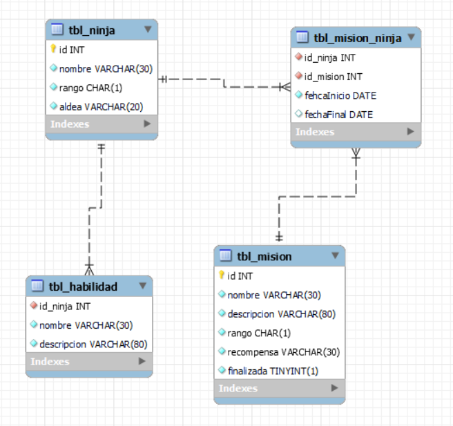
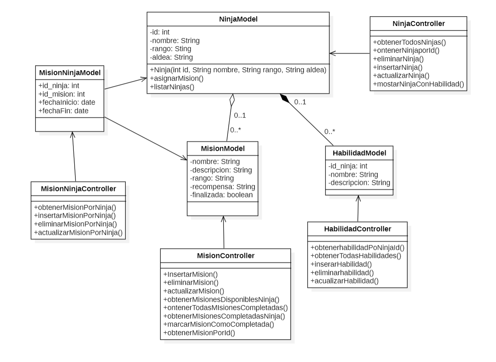

# Filtro final Java U2

En este repositorio se encuentran los archivos necesarios ara la realizacion del filtro de Java U2

### Archivo ejecutable

`AldeaNinjaKonoha`

## Conexcion con la base de datos

En el archivo ConexionDB.java que se encuentra en el paquete `com.mycompany.aldeaninjakonoha.conexion`

Cambiar `user = "root";` Por su usuario de mysql

Cambiar `password = "";` Por la contraseña de su base de datos

```java
    public static Connection MySQLConnection() {

    url = "jdbc:mysql://localhost:3306/ninjaKonoha";
    user = "root";
    password = "";
    return getConnection(url, user, password);
}
```

## Archivos

- DiagramDB
  
- Diagrama de clases
  
  -sql.sql

  Ahi se encuentra el sql e la base de datos
